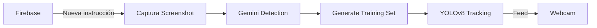

# Vision Tracker 🎯

Sistema inteligente de tracking de objetos controlado por Firebase, usando Gemini AI para detección y YOLOv8 para seguimiento en tiempo real.

## 🌟 Características

- 🔥 **Control vía Firebase** - Cambia instrucciones en tiempo real desde cualquier lugar
- 🤖 **Detección con Gemini AI** - Usa lenguaje natural para describir objetos
- 📸 **Captura automática** - Screenshot automático al cambiar instrucción
- 🎨 **Data Augmentation** - Genera 16 variantes por detección
- 🎯 **Tracking Selectivo** - Solo rastrea objetos que coincidan con el training set
- 🧵 **Multi-threading** - No bloquea la cámara ni Firebase
- ⚡ **Tiempo Real** - Respuesta instantánea a cambios

## 🚀 Quick Start

### 1. Clonar e Instalar

```bash
git clone https://github.com/MateoCabreraVasquez/visionTracker.git
cd visionTracker
python -m venv .venv
.venv\Scripts\activate  # Windows
pip install -r requirements.txt
```

### 2. Configurar Firebase

Ver [docs/FIREBASE_SETUP.md](docs/FIREBASE_SETUP.md) para instrucciones detalladas.

1. Crear proyecto en [Firebase Console](https://console.firebase.google.com/)
2. Activar Realtime Database
3. Descargar credenciales → guardar como `firebase_credentials.json`

### 3. Configurar Variables de Entorno

Copiar `.env.example` a `.env` y completar:

```env
GEMINI_API_KEY=tu_api_key_de_gemini
FIREBASE_DB_URL=https://tu-proyecto.firebaseio.com
FIREBASE_CREDENTIALS_PATH=firebase_credentials.json
```

### 4. Iniciar Sistema

```bash
python src/firebase_tracker_controller.py
```

### 5. Cambiar Instrucción en Firebase

En Firebase Console, crear/editar el nodo `instruction`:

```json
{
  "instruction": "person wearing red shirt"
}
```

## 📁 Estructura del Proyecto

```
visionTracker/
├── src/
│   ├── gemini/                    # Detección con Gemini AI
│   │   ├── gemini_detector.py
│   │   ├── gemini_vision_system.py
│   │   └── bbox_drawer.py
│   ├── person_tracker/            # Sistema de tracking
│   │   ├── person_tracker.py
│   │   └── selective_person_tracker.py
│   ├── training_set/              # Generación de dataset
│   │   └── generate_training_set.py
│   └── firebase_tracker_controller.py  # 🔥 Controlador principal
├── test/                          # Tests
│   ├── gemini/
│   ├── firebase_test/
│   └── tracker_test/
├── docs/                          # Documentación
│   └── FIREBASE_SETUP.md
└── requirements.txt
```

## 🎮 Modos de Uso

### Modo 1: Control por Firebase (Recomendado)

```bash
python src/firebase_tracker_controller.py
```

Cambia instrucciones desde Firebase Console en tiempo real.

### Modo 2: Training Set Manual

```bash
# Generar training set
python src/training_set/generate_training_set.py "ruta/imagen.png" "tu instrucción"

# Iniciar tracking
python test/tracker_test/test_selective_tracker.py
```

### Modo 3: Test de Gemini

```bash
python test/gemini/test_gemini_vision_system.py
```

## 🔄 Flujo de Trabajo



1. **Firebase detecta cambio** en nodo `instruction`
2. **Captura screenshot** de la pantalla
3. **Gemini detecta** objetos según instrucción
4. **Genera 16 variantes** aumentadas por detección
5. **Inicia tracking** selectivo en webcam
6. **Solo rastrea** objetos que coincidan

## 🎨 Data Augmentation

Cada detección genera 16 variantes:

- Rotaciones (±15°, ±30°)
- Flips (horizontal, vertical)
- Brillo (oscuro, brillante)
- Contraste (bajo, alto)
- Blur gaussiano
- Ruido aleatorio
- Zoom (in/out)
- Saturación de color

## 🧵 Threading

El sistema usa 3 hilos independientes:

1. **Main Thread** → Listener de Firebase
2. **Process Thread** → Screenshot + Training set
3. **Tracking Thread** → Video tracking

## 📊 Output Visual

- **🟢 Caja Verde** = Objeto coincide con training set
- **🔴 Caja Roja** = Objeto NO coincide
- **Score** = Similaridad (0.0 - 1.0)

## 🔧 Configuración Avanzada

### Ajustar Umbral de Matching

En `firebase_tracker_controller.py`:

```python
match_threshold=0.6  # 0.6 = balanceado, 0.8 = estricto
```

### Cambiar Device (GPU/CPU)

```python
device='cuda:0'  # GPU
device='cpu'     # CPU
```

### Ajustar Confianza YOLO

```python
conf=0.5  # 0.5 = balanceado, 0.7 = más preciso
```

## 🧪 Tests

```bash
# Test conexión Firebase
python test/firebase_test/test_firebase_connection.py

# Test Gemini detection
python test/gemini/test_gemini_vision_system.py

# Test tracking
python test/tracker_test/test_selective_tracker.py
```

## 📝 Ejemplos de Instrucciones

- `"person wearing glasses"`
- `"woman with curly hair"`
- `"person with backpack"`
- `"man in blue shirt"`
- `"person holding phone"`

## ⚠️ Requisitos

- Python 3.11+
- Webcam
- Cuenta Firebase
- API Key de Gemini
- ~10GB espacio (para YOLOv8)

## 🐛 Troubleshooting

Ver [docs/FIREBASE_SETUP.md](docs/FIREBASE_SETUP.md) sección Troubleshooting.

## 📄 Licencia

MIT License

## 👨‍💻 Autor

Mateo Cabrera Vasquez - [GitHub](https://github.com/MateoCabreraVasquez)

## 🙏 Agradecimientos

- YOLOv8 (Ultralytics)
- Google Gemini AI
- Firebase Realtime Database
